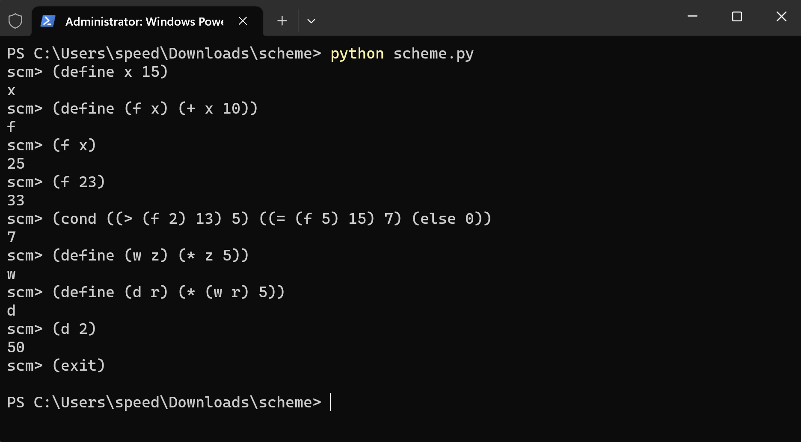

# Scheme Interpreter



This repository contains my implementation of an interpreter for a subset of the Scheme language. This project improved my understanding of lexical and syntactical analysis as well as input parsing.

## Using the Scheme Interpreter

To run my Scheme interpreter, run this code snippet in your terminal

```
python scheme.py
```

## File Descriptions

* scheme.py: the Scheme evaluator
* scheme_reader.py: the Scheme syntactic analyzer
* questions.scm: colleciton of functions
* tests.scm: collection of test cases
* scheme_tokens.py: provdies tokenization
* scheme_primitives.py: definitions for primitive Scheme procedures
* buffer.py: buffer implementation used in scheme_reader.py
* ucb.py: utility functions
